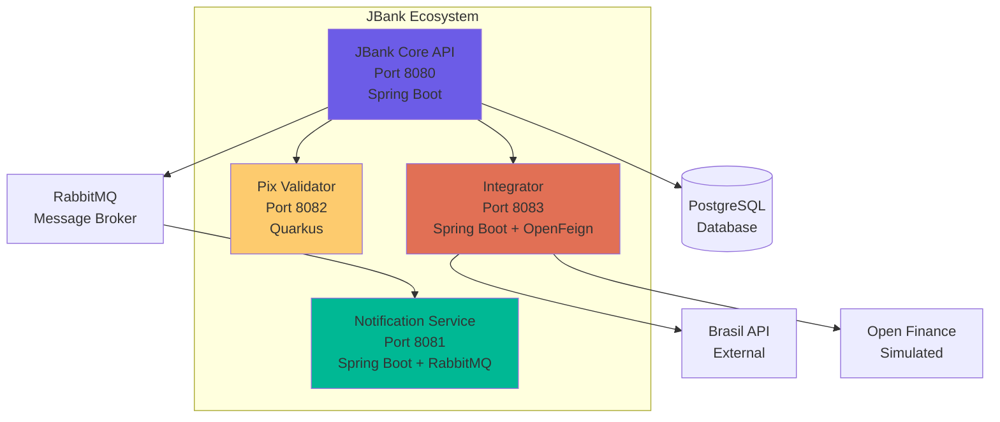

# 🏦 JBank Core API

> **Enterprise-Grade Fintech Backend** with Fort Knox Security, Clean Architecture, and Production-Ready Features


---

## 📖 About

**JBank Core** is a high-performance banking API built to solve **real-world financial challenges**: race conditions in concurrent transactions, data encryption at rest, and distributed event processing. 

This project demonstrates **Senior-level architecture** with:
- 🛡️ **Fort Knox Security Protocol**: JWT + AES-256 + Rate Limiting
- 🏗️ **Clean Architecture + DDD**: Domain-driven, framework-independent core
- ⚡ **Polyglot Microservices**: Spring Boot + Quarkus + OpenFeign
- 📊 **Production Ready**: Swagger UI, Actuator, Circuit Breaker

---

## 🏗️ Architecture

### System Flow


### Microservices Ecosystem



---

## ✨ Key Features

### 🛡️ Fort Knox Security Protocol

- **JWT Stateless Authentication**: No session storage, fully scalable
- **AES-256 Encryption**: PII data (CPF, Email) encrypted at rest
- **Rate Limiting**: Bucket4j prevents brute-force attacks (5 req/min per IP)
- **Transactional PIN**: Secondary authentication for sensitive operations
- **OWASP Dependency Check**: Automated vulnerability scanning

### 💸 Core Banking Features

- **ACID Transactions**: Pessimistic locking prevents race conditions
- **PIX Integration**: Key registration (EMAIL, CPF, PHONE, RANDOM)
- **Wallet Management**: Real-time balance updates with concurrency control
- **Audit Logs**: Complete transaction history for compliance

### 📊 Production Readiness

- **Swagger UI**: Interactive API documentation (`/swagger-ui.html`)
- **Spring Actuator**: Health checks and metrics (`/actuator/health`)
- **Circuit Breaker**: Resilience4j for external integrations
- **Event-Driven**: RabbitMQ for async notifications

### 🌐 External Integrations

- **Brasil API**: Real-time Brazilian banks data (~200 banks)
- **Open Finance**: Architecture ready for OAuth2 integration

---

## 🚀 Quick Start

### Prerequisites

- **Java 21** ([Download](https://adoptium.net/))
- **Docker Desktop** ([Download](https://www.docker.com/products/docker-desktop))

### One-Click Start 🎯

**Windows:**
```bash
run.bat
```

**Linux/Mac:**
```bash
chmod +x run.sh
./run.sh
```

**That's it!** The script will:
1. ✅ Check if Docker is running
2. ✅ Build the project (`mvn clean package`)
3. ✅ Start all containers (`docker-compose up`)
4. ✅ Display access URLs

### Manual Start

```bash
# Clone the repository
git clone https://github.com/engpamelams-creator/JBankCore_Project_Java.git
cd JBankCore

# Start with Docker Compose
docker-compose up --build
```

### Access Points

| Service | URL | Description |
|---------|-----|-------------|
| **Swagger UI** | http://localhost:8080/swagger-ui.html | Interactive API docs |
| **Actuator Health** | http://localhost:8080/actuator/health | Health check |
| **Actuator Metrics** | http://localhost:8080/actuator/metrics | Application metrics |
| **RabbitMQ Management** | http://localhost:15672 | Message broker UI (guest/guest) |
| **Integrator API** | http://localhost:8083/integrations/banks | Brazilian banks list |

---

## 📚 Documentation

### API Endpoints

Access the **Swagger UI** for complete API documentation:  
👉 **http://localhost:8080/swagger-ui.html**

**How to authenticate:**
1. Use `POST /auth/signup` to create an account
2. Use `POST /auth/login` to get your JWT token
3. Click **"Authorize"** in Swagger UI
4. Enter: `Bearer <your-token>`
5. Test protected endpoints!

### Core Modules

- **Users** (`/modulos/usuarios`): Registration, authentication, profile management
- **Wallets** (`/modulos/carteiras`): Balance management, ACID transactions
- **Transactions** (`/modulos/transacoes`): Money transfers with pessimistic locking
- **PIX** (`/modulos/pix`): PIX key registration and management

---

## 📁 Project Structure

```
JBankCore/
├── Back-end/                          # Main application
│   ├── src/main/java/br/com/jbank/core/
│   │   ├── modulos/                   # Business modules (DDD)
│   │   │   ├── usuarios/              # User management
│   │   │   ├── carteiras/             # Wallet management
│   │   │   ├── transacoes/            # Transactions
│   │   │   └── pix/                   # PIX integration
│   │   ├── infra/                     # Infrastructure layer
│   │   │   ├── defense/               # Security (JWT, Rate Limit)
│   │   │   ├── messaging/             # RabbitMQ config
│   │   │   └── config/                # Spring config
│   │   └── shared/                    # Shared utilities
│   ├── jbank-notification/            # Notification microservice
│   ├── jbank-pix-validator/           # Pix validator (Quarkus)
│   └── jbank-integrator/              # External integrations
├── DevOps-defense/                    # Security & DevOps
│   ├── scan-secrets.sh                # Secret scanner
│   └── security-audit.md              # Security documentation
├── docker-compose.yml                 # Container orchestration
├── run.bat / run.sh                   # One-click start scripts
└── README.md                          # This file
```

### Why `DevOps-defense`?

This folder contains **security automation** and **audit documentation**:
- **Secret Scanner**: Prevents accidental password commits
- **OWASP Dependency Check**: Automated vulnerability scanning
- **Security Audit**: Compliance documentation

---

## 🛠️ Tech Stack

### Core Technologies

| Category | Technology |
|----------|-----------|
| **Language** | Java 21 |
| **Frameworks** | Spring Boot 3.4, Quarkus 3.6 |
| **Database** | PostgreSQL 16 |
| **Message Broker** | RabbitMQ 3.13 |
| **API Integration** | Spring Cloud OpenFeign |
| **Containerization** | Docker, Docker Compose |

### Security & Observability

| Feature | Implementation |
|---------|---------------|
| **Authentication** | JWT (jjwt 0.11.5) |
| **Encryption** | AES-256 (Java Crypto) |
| **Rate Limiting** | Bucket4j 7.6.0 |
| **API Docs** | SpringDoc OpenAPI 2.3.0 |
| **Monitoring** | Spring Boot Actuator |
| **Resilience** | Resilience4j Circuit Breaker |

---

## 🎓 Learning Highlights

This project demonstrates:

✅ **Clean Architecture**: Domain layer independent of frameworks  
✅ **DDD (Domain-Driven Design)**: Business logic in domain entities  
✅ **CQRS Pattern**: Separate read/write operations  
✅ **Event-Driven Architecture**: Async processing with RabbitMQ  
✅ **Gateway Pattern**: Centralized external integrations  
✅ **Circuit Breaker**: Resilience for external APIs  
✅ **Pessimistic Locking**: Prevents race conditions in transactions  
✅ **Multi-Stage Docker Builds**: Optimized container images  

---

## 🤝 Contributing

Contributions are welcome! Please feel free to submit a Pull Request.

---

## 📄 License

This project is licensed under the MIT License - see the [LICENSE](LICENSE) file for details.

---

## 👩‍💻 Author

**Pamela Menezes**  
Senior Java Architect | Fintech Specialist

[](https://github.com/engpamelams-creator)
[](https://linkedin.com/in/pamela-menezes)

---

<div align="center">

**⭐ If you found this project helpful, please give it a star!**

Made with ❤️ and ☕ by Pamela Menezes

</div>
