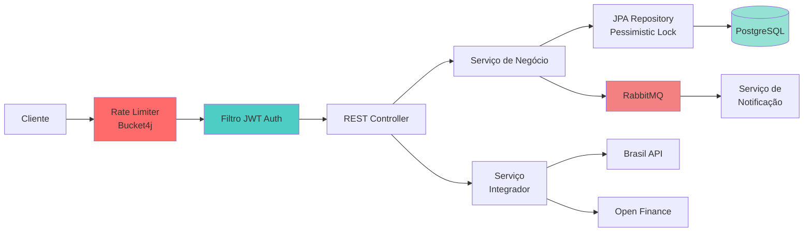
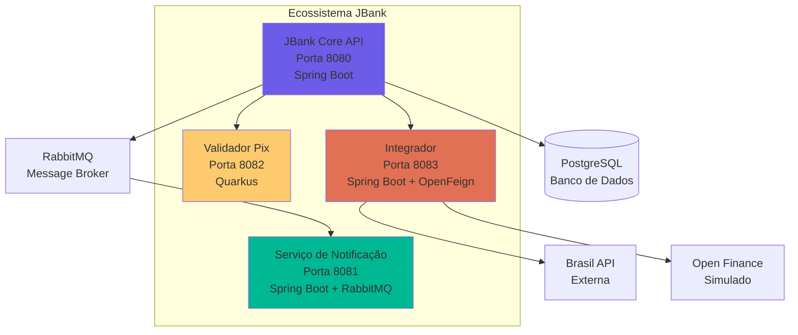

# 🏦 JBank Core API

> **Backend Fintech de Nível Empresarial** com Segurança Fort Knox, Clean Architecture e Recursos Production-Ready


---

## 📖 Sobre

**JBank Core** é uma API bancária de alta performance construída para resolver **desafios financeiros do mundo real**: condições de corrida em transações concorrentes, criptografia de dados em repouso e processamento de eventos distribuídos.

Este projeto demonstra **arquitetura de nível Sênior** com:
- 🛡️ **Protocolo de Segurança Fort Knox**: JWT + AES-256 + Rate Limiting
- 🏗️ **Clean Architecture + DDD**: Núcleo orientado a domínio, independente de frameworks
- ⚡ **Microsserviços Poliglotas**: Spring Boot + Quarkus + OpenFeign
- 📊 **Production Ready**: Swagger UI, Actuator, Circuit Breaker

---

## 🏗️ Arquitetura

### Fluxo do Sistema



### Ecossistema de Microsserviços



---

## ✨ Principais Funcionalidades

### 🛡️ Protocolo de Segurança Fort Knox

- **Autenticação JWT Stateless**: Sem armazenamento de sessão, totalmente escalável
- **Criptografia AES-256**: Dados PII (CPF, Email) criptografados em repouso
- **Rate Limiting**: Bucket4j previne ataques de força bruta (5 req/min por IP)
- **PIN Transacional**: Autenticação secundária para operações sensíveis
- **OWASP Dependency Check**: Verificação automatizada de vulnerabilidades

### 💸 Funcionalidades Bancárias Core

- **Transações ACID**: Bloqueio pessimista previne condições de corrida
- **Integração PIX**: Registro de chaves (EMAIL, CPF, TELEFONE, ALEATÓRIA)
- **Gestão de Carteiras**: Atualizações de saldo em tempo real com controle de concorrência
- **Logs de Auditoria**: Histórico completo de transações para conformidade

### 📊 Production Readiness

- **Swagger UI**: Documentação interativa da API (`/swagger-ui.html`)
- **Spring Actuator**: Health checks e métricas (`/actuator/health`)
- **Circuit Breaker**: Resilience4j para integrações externas
- **Event-Driven**: RabbitMQ para notificações assíncronas

### 🌐 Integrações Externas

- **Brasil API**: Dados de bancos brasileiros em tempo real (~200 bancos)
- **Open Finance**: Arquitetura preparada para integração OAuth2

---

## 🚀 Início Rápido

### Pré-requisitos

- **Java 21** ([Download](https://adoptium.net/))
- **Docker Desktop** ([Download](https://www.docker.com/products/docker-desktop))

### Início com Um Clique 🎯

**Windows:**
```bash
cd Back-end
run.bat
```

**Linux/Mac:**
```bash
cd Back-end
chmod +x run.sh
./run.sh
```

**É isso!** O script irá:
1. ✅ Verificar se o Docker está rodando
2. ✅ Compilar o projeto (`mvn clean package`)
3. ✅ Iniciar todos os containers (`docker-compose up`)
4. ✅ Exibir URLs de acesso

### Início Manual

```bash
# Clone o repositório
git clone https://github.com/engpamelams-creator/JBankCore_Project_Java.git
cd JBankCore

# Inicie com Docker Compose
docker-compose up --build
```

### Pontos de Acesso

| Serviço | URL | Descrição |
|---------|-----|-----------|
| **Swagger UI** | http://localhost:8080/swagger-ui.html | Documentação interativa da API |
| **Actuator Health** | http://localhost:8080/actuator/health | Health check |
| **Actuator Metrics** | http://localhost:8080/actuator/metrics | Métricas da aplicação |
| **RabbitMQ Management** | http://localhost:15672 | UI do message broker (guest/guest) |
| **Integrator API** | http://localhost:8083/integrations/banks | Lista de bancos brasileiros |

---

## 📚 Documentação

### Endpoints da API

Acesse o **Swagger UI** para documentação completa da API:  
👉 **http://localhost:8080/swagger-ui.html**

**Como autenticar:**
1. Use `POST /auth/signup` para criar uma conta
2. Use `POST /auth/login` para obter seu token JWT
3. Clique em **"Authorize"** no Swagger UI
4. Digite: `Bearer <seu-token>`
5. Teste os endpoints protegidos!

### Módulos Core

- **Usuários** (`/modulos/usuarios`): Registro, autenticação, gestão de perfil
- **Carteiras** (`/modulos/carteiras`): Gestão de saldo, transações ACID
- **Transações** (`/modulos/transacoes`): Transferências de dinheiro com bloqueio pessimista
- **PIX** (`/modulos/pix`): Registro e gestão de chaves PIX

---

## 📁 Estrutura do Projeto

```
JBankCore/
├── Back-end/                          # Aplicação principal
│   ├── src/main/java/br/com/jbank/core/
│   │   ├── modulos/                   # Módulos de negócio (DDD)
│   │   │   ├── usuarios/              # Gestão de usuários
│   │   │   ├── carteiras/             # Gestão de carteiras
│   │   │   ├── transacoes/            # Transações
│   │   │   └── pix/                   # Integração PIX
│   │   ├── infra/                     # Camada de infraestrutura
│   │   │   ├── defense/               # Segurança (JWT, Rate Limit)
│   │   │   ├── messaging/             # Configuração RabbitMQ
│   │   │   └── config/                # Configuração Spring
│   │   └── shared/                    # Utilitários compartilhados
│   ├── jbank-notification/            # Microsserviço de notificação
│   ├── jbank-pix-validator/           # Validador Pix (Quarkus)
│   └── jbank-integrator/              # Integrações externas
├── DevOps-defense/                    # Segurança & DevOps
│   ├── scan-secrets.sh                # Scanner de segredos
│   └── security-audit.md              # Documentação de segurança
├── docker-compose.yml                 # Orquestração de containers
└── README.md                          # Este arquivo
```

### Por que `DevOps-defense`?

Esta pasta contém **automação de segurança** e **documentação de auditoria**:
- **Scanner de Segredos**: Previne commits acidentais de senhas
- **OWASP Dependency Check**: Verificação automatizada de vulnerabilidades
- **Auditoria de Segurança**: Documentação de conformidade

---

## 🛠️ Stack Tecnológica

### Tecnologias Core

| Categoria | Tecnologia |
|----------|-----------|
| **Linguagem** | Java 21 |
| **Frameworks** | Spring Boot 3.4, Quarkus 3.6 |
| **Banco de Dados** | PostgreSQL 16 |
| **Message Broker** | RabbitMQ 3.13 |
| **Integração de API** | Spring Cloud OpenFeign |
| **Containerização** | Docker, Docker Compose |

### Segurança & Observabilidade

| Funcionalidade | Implementação |
|---------|---------------|
| **Autenticação** | JWT (jjwt 0.11.5) |
| **Criptografia** | AES-256 (Java Crypto) |
| **Rate Limiting** | Bucket4j 7.6.0 |
| **Documentação API** | SpringDoc OpenAPI 2.3.0 |
| **Monitoramento** | Spring Boot Actuator |
| **Resiliência** | Resilience4j Circuit Breaker |

---

## 🎓 Destaques de Aprendizado

Este projeto demonstra:

✅ **Clean Architecture**: Camada de domínio independente de frameworks  
✅ **DDD (Domain-Driven Design)**: Lógica de negócio em entidades de domínio  
✅ **Padrão CQRS**: Operações de leitura/escrita separadas  
✅ **Arquitetura Event-Driven**: Processamento assíncrono com RabbitMQ  
✅ **Padrão Gateway**: Integrações externas centralizadas  
✅ **Circuit Breaker**: Resiliência para APIs externas  
✅ **Bloqueio Pessimista**: Previne condições de corrida em transações  
✅ **Builds Docker Multi-Stage**: Imagens de container otimizadas  

---

## 🤝 Contribuindo

Contribuições são bem-vindas! Sinta-se à vontade para enviar um Pull Request.

---

## 📄 Licença

Este projeto está licenciado sob a Licença MIT - veja o arquivo [LICENSE](LICENSE) para detalhes.

---

## 👩‍💻 Autora

**Pamela Menezes**  
Arquiteta Java Sênior | Especialista em Fintech

[](https://github.com/engpamelams-creator)
[](https://linkedin.com/in/pamela-menezes)

---

<div align="center">

**⭐ Se este projeto foi útil para você, por favor dê uma estrela!**

Feito com ❤️ e ☕ por Pamela Menezes

</div>
